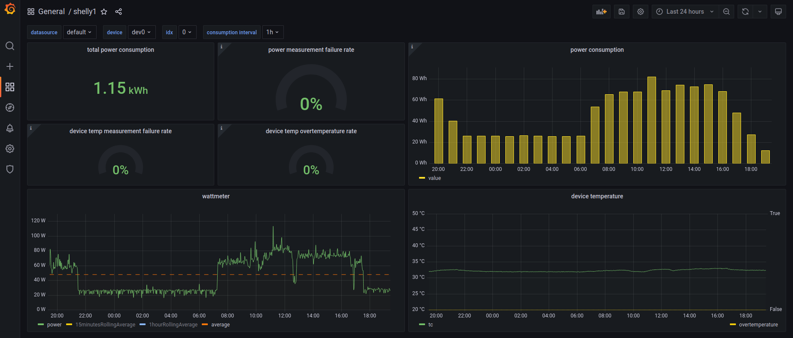

# shellyscraper-ile

Collect data from Shelly devices, insert them into QuestDB and visualize data in Grafana.

Supported devices:

- Shelly Plug (SHPLG-1)
- Shelly Plug S (SHPLG-S)
- Shelly Plug US (SHPLG-U1)
- Shelly Plug E (SHPLG2-1)
- Shelly Plus Plug IT (SNPL-00110IT)
- Shelly Plus Plug S (SNPL-00112EU)
- Shelly Plus Plug UK (SNPL-00112UK)
- Shelly Plus Plug US (SNPL-00116US)
- Shelly H&T (SHHT-1)
- Shelly Plus H&T (SNSN-0013A)



## stack

The solution consists of the following:

* supported Shelly devices (the devices you have)
* QuestDB (database)
* Grafana (data visualization tool)
* scraper (a custom script that retrieves data using a device API and inserts them into the database)
* dashboard (data visualization dashboard)

## configuration

* Assign a static IP address to your Shelly device(s) on your router.
* See the description of the `shellyscraper.py` script to learn about the configuration options.
* Create a docker network and docker volumes for data storage.

```shell
docker network create --subnet=192.168.130.0/24 ile-network
docker volume create ile-questdb-data
docker volume create ile-grafana-data
```

* Run everything that the solution consists of:

```shell
# https://questdb.io/docs/reference/configuration/#docker
docker run -d --restart=unless-stopped \
    --net ile-network --ip 192.168.130.10 \
    --name=ile-questdb \
    -p 9000:9000 -p 9009:9009 -p 8812:8812 -p 9003:9003 \
    -v ile-questdb-data:/root/.questdb/ \
    questdb/questdb:7.1.1
```

```shell
# https://grafana.com/docs/grafana/latest/installation/docker/
docker run -d --restart=unless-stopped \
    --net ile-network \
    --name=ile-grafana \
    -p 3000:3000 \
    -v ile-grafana-data:/var/lib/grafana \
    grafana/grafana-oss:8.5.24
```

```shell
docker build -t "ile-shellyscraper:0.0.1" -f Dockerfile .
```

As the value of the ILE_SHELLY_IPS env, enter the comma-separated list of IPs assigned to your Shelly plugs devices.

```shell
docker run -d --restart=unless-stopped \
    --net ile-network \
    --name=ile-shellyscraper \
    -p 9080:9080 \
    -p 9081:9081 \
    -e ILE_QUESTDB_HOST=192.168.130.10 \
    -e ILE_QUESTDB_PORT=9009 \
    -e ILE_SHELLY_IPS=192.168.50.101,192.168.50.102 \
    -e ILE_DEBUG=false \
    ile-shellyscraper:0.0.1
```

* Log in to the grafana (admin:admin), add the data source (https://questdb.io/tutorial/2020/10/19/grafana/#create-a-data-source), and
  import dashboards (`grafana-dashboard-*.json` files).
* Configure your Shelly H&T devices so that the "report sensor values" URL is "http://{docker_machine_ip}:9080/".
* Configure your Shelly Plus H&T devices so that the outgoing WebSocket server is "ws://{docker_machine_ip}:9081/".
* Secure the solution (some passwords? firewall rules?) if this is to be available outside your home network.
